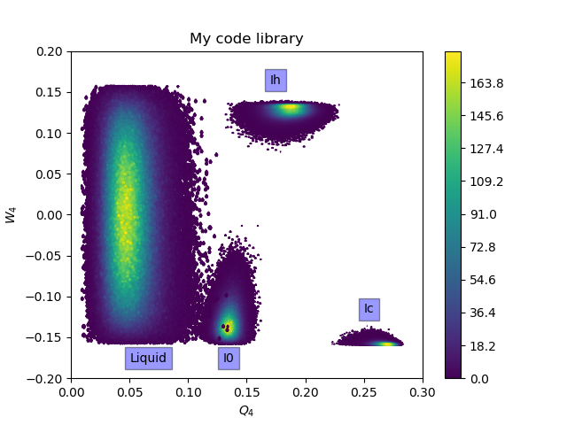

# A usable and efficient order parameter analysis library for condensed matter system

## Examples: 

## Features: 

- [x] General spherical harmonics for any order

- [x] Optimized spherical harmonics at order 4, 6, 12 

- [x] Wigner3j symbol

- [x] local/global second-order and third-order invariants

- [x] Coarse-grained/dot-product invariants

- [x] CHILL/CHILL+ algorithm 

- [x] RussoRomanoTanaka order parameter 

- [x] Iq6 order parameter by Li et al.

- [x] Single linkage clustering algorithm

- [x] Tetrahedral order parameter algorithm 

- [x] Pair Correlation Function

* [ ] Structure factor (Homogeneous and Binary)

* [ ] Bhatia-Thornton Analysis 

## Other Features:

* C-callable Fortran routines

* Python importable for analysis 

* Modular design 

 
