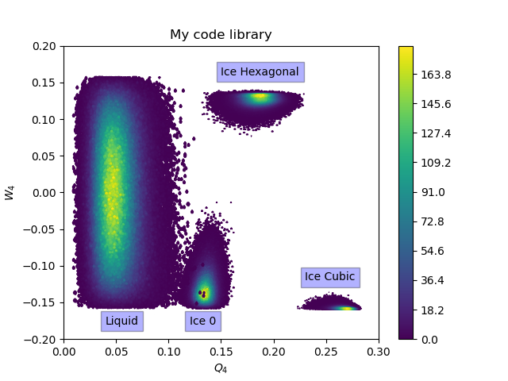

# A usable and efficient order parameter analysis library for condensed matter system

## Examples: 

## Features: 

- [x] general spherical harmonics for any order

- [x] optimized spherical harmonics at order 4 

- [x] optimized spherical harmonics at order 6 

- [x] optimized spherical harmonics at order 12

- [x] Wigner3j symbol

- [x] single linkage clustering algorithm

- [x] local/global second-order and third-order invariants

- [x] CHILL/CHILL+ algorithm 

- [x] Iq6 by Li et al.

## Other Features:

* C-callable Fortran routines

* Python importable for analysis 

* Modular design 

 
